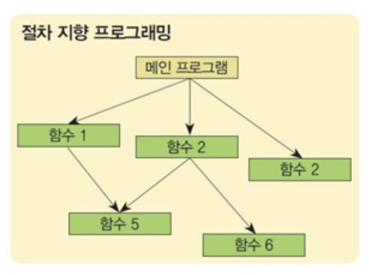
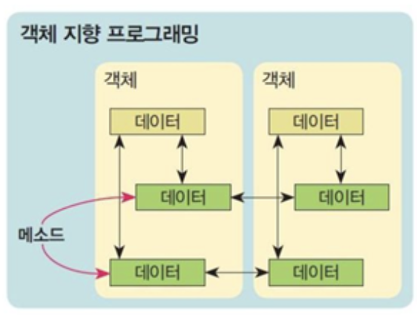

# 메모리 영역
- C++의 프로그램에서 사용하는 메모리는 일반적으로 4가지 영역으로 나눈다.

### Code영역
- 컴파일된 프로그램이 저장되는 영역

### Data영역
- 전역 변수, 정적(static) 변수가 저장되는 영역

### Heap영역
- 동적 할당된 변수가 할당되는 영역

### Statck영역
- 지역 변수, 매개변수 및 기타 함수 관련 정보가 저장되는 영역

# Heap영역
- Heap영역은 동적 메모리 할당에 사용되는 메모리를 추적한다.

## Heap 영역의 특징
- 힙에 메모리를 할당하는 것은 비교적 느리다.
- 할당된 메모리는 명시적으로 할당 해제하거나 응용 프로그램이 종료될 때까지 유지된다. (메모리 누수 주의)
- 동적으로 할당된 메모리는 포인터를 통해 접근한다: 포인터를 역참조하는 것은 변수에 직접 접근하는 것보다 느리다.
- 힙은 큰 메모리 풀이므로 큰 배열, 구조체 또는 클래스를 할당할 수 있다.

## 메모리의 정적할당(static memory allocation)
- 크기가 결정되는 시점 -> compile시
- 크기가 결정되어 있음
- 프로세스 메모리 영역중에 데이터영역, 스택영역에 할당

## 메모리의 동적할당
- 크기가 결정되는 시점 -> runtime 시
- 프로세스 메모리 영역중에 힙영역에 할당된다.
- 필요할 때 메모리를 할당하고 더 이상 그 공간이 필요하지 않으면 반환할 수 있게 하는 것.
- 그런데 동적 메모리 할당으로 생성된 저장공간은 이름이 없어 변수처럼 그 이름을 통해 액세스할 수 없다.
- 동적으로 할당된 저장공간을 포인터 변수가 가리키게 하면 그 포인터를 이용하여 액세스할 수 있다.

### 동적할당1.c
```c
#include <stdlib.h>

using namespace std;

int main(){

    //C버전의 동적할당
    int* arr1 = (int*)malloc(sizeof(int)*5);

    //C버전의 동적할당 해제
    free(arr1);

    return 0;
}
```

## new와 delete

### new
- 동적 메모리 할당은 다음과 같이 new 연산자를 이용한다.
- new 연산자와 malloc()함수의 차이점은 '메모리의 크기를 정하지 않는다'라는것이다.
```c
1. 포인터변수 = new 자료형;
2. 포인터변수 = new 자료형[n];
```
- 1번은 지정된 자료형의 데이터 1개를 저장할 수 있는 공간을 할당하며, 그 주소를 포인터 변수에 넣는다.<br>이 때 자료형은 포인터의 자료형과 일치해야 한다.
- 번은 지정된 자료형의 데이터를 n개 저장할 수 있는 배열을 할당한다. n은 양의 정수값을 내는 수식이면 되며, 상수가 아니어도 된다.


### delete
- delete 연산자는 new 연산자의 형식1로 할당한 메모리 공간을 반환할 때 사용한다.
- delete [] 연산자는 형식2의 방법으로 new 연산자를 사용하여 할당한 메모리 공간을 반환할 때 사용한다.

```c
1. delete 포인터변수;
2. delete [] 포인터변수;
```

### 동적할당2.cpp
```c
#include <iostream>

using namespace std;

void main() {
	int* a = new int;
	int* b = new int(2); //동적할당을 받으면서 값을 초기화 할 수 있다.

	//C++에서는 new 키워드로 동적할당을 한다.
	int *arr3 = new int[5];

	*a = 1;

	int* arr3 = new int[5];

	//new로 동적할당한 메모리는 쓰레기 값이 저장된다.
	//초기화를 해줄 코드가 필요하다.
    for(int i = 0 ; i< 5; i++){
        arr3[i] = 0;
    }
	
     for(int i = 0; i < 5; i++){
       cout << arr3[i]<<" " << endl;
    }

	cout << *a << endl;
	cout << *b << endl;


	//변수타입 할당 해제
	delete a;
	delete b;

	//배열타입 할당 해제
	delete[] arr3;
}
```

### 동적할당연습1.cpp(10분)
```c
#include <iostream>

using namespace std;

int main(){
    //동적 메모리 할당을 이용하여 학생들의
    //점수를 처리하는 프로그램을 작성하시오
    //성적을 입력할 학생 수 만큼 메모리를 할당하여 성적을 입력받는다.
    //입력받은 점수의 총합과 평균 그리고 최대값을 구한다.
    
    int n;
    int sum = 0;
    double avg;
   

    cout << "성적을 입력할 학생 수 : ";
    cin >> n;

    int* student = new int[n];

    cout << n<<" 명의 학생 점수를 입력하시오..."<<endl;
    for(int i = 0; i < n; i++){
        
        cin >> student[i];
    }

     int max = student[0];
    
    for(int i = 0; i < n; i++){
        
        sum += student[i];
        if(max < student[i]){
            max = student[i];
        }
    }

    avg = (double)sum / n;

    cout << "학 생  수 : " << n << endl;
    cout << "총     합 : " << sum << endl;
    cout << "평     균 : " << avg << endl;
    cout << "최 대  값 : " << max << endl;

    return 0;
}
```

### 동적할당연습2.cpp(10분)
```c
#include <iostream>
#include <string>

using namespace std;

int main(){
    //string 동적 배열을 이용한 문자열 처리
    //string 동적 배열을 이용하여 학생의 이름을 처리하는
    //프로그램을 작성하시오

    //입력할 학생 수 만큼 메모리를 할당하여 성적을 입력받는다.
    //단, 한 명당 10개의 문자를 저장할 수 있는 배열을 이용한다.

    //실행 예
    //입력할 문자열 개수 : 3
    //1 번째 이름 : 서두옥
    //2 번째 이름 : 홍길동
    //3 번째 이름 : 제임스

    //### 문자열 출력 ###
    //서두옥
    //홍길동
    //제임스

    int count = 0;
    cout << "입력할 문자열 개수 : ";
    cin >> count;

    string* student = new string[count];

    for(int i = 0; i < count; i++){
        cout << i+1 << " 번째 이름 : ";
        cin >> student[i];
    }

    cout << "\n### 문자열출력 ###\n" <<endl;
    for(int i = 0; i <count; i++){
        cout << student[i] << endl;
    }
    return 0;
}
```

## 동적 재할당
- c언어에서는 realloc()메서드를 통해 동적할당된 메모리의 크기를 늘리거나, 줄이는것이 가능하다.
- 하지만 c++에서는 메모리를 재할당 하는것이 불가능하다.

### 메모리재할당.cpp
```c
#include <iostream>
#include <stdlib.h>


using namespace std;

int main(){

    char* p = (char*)malloc(10);

    
    p = (char*)realloc(p,20);//동적할당메모리 재할당
    p = (char*)realloc(p,5);

    char* a = new char[5];
    //C++에서는 동적할당한 메모리를 
    //재할당 할 수 없다.

    //delete[] a; //동적할당을 해제 한 후
    //a = new char[10];//다시할당해야 한다.

    char* b = new char[10];
    for(int i = 0; i < 5; i++){
        b[i] = a[i];
    }

    delete [] a;

    return 0;
}
```
# 레퍼런스(참조자)
- c++에서는 특정 변수의 실제 이름 대신 사용할 수 있는 참조자(reference)라는 새로운 기능이 추가되었습니다.
- 레퍼번스 변수는 이름이 붙여진 변수의 메모리에 다른 이름을 부여하는 형태로 메모리를 잡지 않는다는 이점이 있다.
- 참조자는 크기가 큰 구조체와 같은 데이터를 함수의 인수로 전달해야 할 경우에 사용할 수 있습니다.
- 또한, c++의 클래스(class)를 설계할 때에도 자주 사용됩니다.

## 참조자의 선언
```c
int 변수명; //변수의 선언
int& 참조자명 = 변수명; //참조자 선언
```
- 앰퍼샌드(&)는 주소 연산자가 아닌 타입을 식별하기 위해 사용하는 식별자로 사용된 것이다.
- 이렇게 선언된 참조자는 대상 변수와 같은 메모리 위치를 참조하게 된다.

## 참조자 선언시 주의사항
1. 참조자의 타입은 대상이 되는 변수의 타입과 일치해야 한다.
2. 참조자는 선언과 동시에 초기화되어야 한다.
3. 참조자는 한 번 초기화되면, 참조하는 대상을 변경할 수 없다.

### 레퍼런스1.cpp
```c
#include <iostream>
using namespace std;

int main(){

    int a = 10;

    //포인터변수
    int* p = &a; //일반변수의 주소를 p에 저장
    *p = 20;//포인터 연산자로 일반변수에 접근

    cout << a <<endl;

    //레퍼런스(참조자) 변수
    int& ref = a; // 변수 a의 별칭(alias)을 부여
    int r = a;
    cout << ref << endl;
    ref = 30; //레퍼런스가 변경되면 a도 변경된다.
    r = 40; //r값이 바뀌어도 a의 값은 변하지 않는다.

    cout << a << endl;

    return 0;
}
```

### 레퍼런스2.cpp
```c
#include <iostream>
#define FIVE 5 //상수에 별칭 붙히는것

typedef int element; //타입에 별칭 붙히는것

using namespace std;

int main(){

    int a = 10;
    int b = 10;


    //int& ref; 레퍼런스 변수는 초기화 하지 않으면 오류발생
    //int& ref = 10; 값을 직접 넣는것도 안된다.

    int& ref = a;//변수에 별칭을 붙히는것
    ref = 20;
    cout << "a=" << ref << endl;
    
    ref = b; //레퍼런스 변수가 참조하는 변수는 바뀌지 않음
    ref = 20;
    cout << "b="<< b <<endl;

    int* p = &a;
    p = &b; //다른 주소를 대입하는게 가능하다.
    
    return 0;
}
```

### 레퍼런스3.cpp
```c
#include <iostream>
using namespace std;

//c++에서 레퍼런스가 아닌 일반변수나 포인터를 사용하여 인자로 받으면 인자로 받는 과정에서 임시 변수를 생성하여 메모리를 잡고 그 메모리에 들어온 인자로 글어오는 값을 복사해 사용하는 과정이 있다.

void print(int a){ //call-by-value 값에 의한 호출(매개변수가 일반변수)
    cout << a << endl;
}

void hundred(int* a){//call-by-address 주소에 의한 호출(매개변수가 포인터변수)
    *a = 100;
    print(*a);


}

void thousand(int& a){//call-by-reference 참조에 의한 호출(매개변수가 레퍼런스)
    a = 1000; //값을 변경하거나 참조할 때 모두 *연산자를 쓰지않아도 된다.
    print(a);
}

void main(){
    int a = 10;
    hundred(&a);
    thousand(a);
}
```

### 레퍼런스4.cpp
```c
#include <iostream>
using namespace std;

void main(){

    int arr[5] = {1,2,3,4,5};

    //for-each문의 변수가 일반변수이면 배열의 값을 변경할 수 없음
    for(int a : arr){
       a = 0;
    }

    for(int a : arr){
        cout << a << " ";
    }

    //레퍼런스 변수를 사용하면 변경하는 것이 가능
    for(int& a : arr){
       a = 0;
    }

    for(int a : arr){
        cout << a << " ";
    }

}

```

### 레퍼런스연습1.cpp
```c
#include <iostream>
#include <string>

using namespace std;

//레퍼런스 변수와 for-each문을 사용할 것
//print();
void print(int& a, int& b){
    cout << "a="<< a <<", b="<< b <<endl;
}
//swap();
void swap(int& a, int& b){
    int temp = a;
    a = b;
    b = temp;
}
//one();
void one(int* arr, int size){
   for(int i = 0; i < size; i++){
        arr[i] = 1;
    }
}
//printarr();
void printarr(int* arr,int size){
    string s = "[ ";
    for(int i = 0; i < size; i++){
        s = s + to_string(arr[i])+" ";
    }
    s =  s + " ]";

    cout << s << endl;
}

int main(){

    int a = 10, b = 20;
    print(a,b); //a=10, b=20 출력
    swap(a,b); //a와 b의 값을 교환
    print(a,b); //a=20, b=10 출력

    int arr[] = {1,2,3,4,5};
    one(arr,5); //arr의 모든 요소를 1로 변경
    printarr(arr,5); //arr출력  [ 1 1 1 1 1 ]
}
```

# 절차지향 vs 객체지향

## 절차지향(Procedure Oriented Program)
- 함수 위주의 프로그램
- 데이터와 기능(함수)이 분리됨

## 객체지향(Object Oriented Program : OOP)
- 클래스 위주의 프로그램
- 데이터와 기능(메서드) 합쳐짐



# 구조체
- 지금까지 사용한 int, float 등과 같은 자료형은 C++에 미리 정의되어 있는 기본 자료형이다.
- 이와는 별개로 프로그래머가 필요에 따라 새로운 자료형을 정의할 수 있다.
- 구조체를 사용자 정의 자료형이라고 할 수 있는데, 기본 자료형이나 앞서 선언된 사용자 정의 자료형을 이용하여 정의한다.

### 구조체 생성 방법
```c
struct 구조체명{
   Type1 변수명1;
   Type2 변수명2;
   ...
}
```
- Type1, Type2는 기본 자료형의 하나일 수도 있고, 먼저 정의된 사용자 정의 자료형일 수도 있다.

### 구조체 변수의 선언
```c
구조체명 변수명;
```

## 구조체 실습
- 원의 넓이를 구하기

### 구조체.cpp
```c
#include <iostream>
#include <string>
#include <cstdio>
#include <string.h>

using namespace std;

//C언어는 데이터와 기능이 분리된다.
typedef struct{
    int radius;
    char color[30];
}Circle1;

//원의 넓이를 구하는 함수
double cArea(Circle1* c){
    return c -> radius * c -> radius * 3.14;
};

int main(){

    Circle1 a; //= {10, "red"};
    a.radius = 10;
    strcpy_s(a.color,30,"red");
    printf("%.2f",cArea(&a));s

    return 0;
}
```

# 클래스
- 구조체(struct)는 프로그램으로 표현하고자 하는 대상에 대한 데이터의 구조만을 정의하고 있다.
- 클래스(class)는 마치 객체의 설계도와 같다.
- 클래스에는 객체가 포함할 속성에 대한 명세와 메소드들이 정의되어 있어
- 클래스를 이용하여 동일한 속성 및 메소드를 갖는 객체들을 생성한다.

# 객체
- 객체는 실세계의 문제영역에 존재하는 대상물을 그 대상물의 속성(attribute)과 메소드(method)로 모델링한 것이다.
- 객체의 속성은 그 객체의 상태를 나타내는 데이터이며, 객체의 메소드는 내부의 데이터를 사용하여 정해진 동작을 하는 함수이다.
- 사실 세상에 존재하는 모든 것들이 전부 대상이며, 어느 것은 객체로 표현되고 어느 것은 안 된다는 식으로 한계를 지을 수 없다.


# 메세지
- 하나의 프로그램에 객체가 하나만 존재하는 경우는 거의 없다. 일반적으로 여러 개의 객체가 포함되어 있으며, 프로그램이 필요한 기능을 해내기 위해서는 이들이 상호작용해야만 한다.
- 한 객체가 다른 객체의 기능을 필요로 한다면 그 객체는 상대방 객체에게 필요한 작업이 이루어지도록 요구한다.
- 이와 같이 상대방 객체에게 필요한 작업을 실행하도록 요구하는 것을 객체지향 프로그래밍에서는 메시지를 보낸다고 한다.
- 객체지향 언어에서 메시지를 보내는 것은 그 메시지를 처리할 메소드, 즉 함수를 호출하는 것을 의미한다.


# 캡슐화
- 캡슐화(encapsulation)는 객체의 사용자 측면의 사항과 설계자 측면의 사항을 분리하는 것이다.
- 객체의 사용자에게는 객체에게 어떤 메시지를 어떻게 보냄으로써 그 객체가 동작하게 할 수 있는가에 대한 정보가 필요하다.
- 세부적인 객체 내부 상태의 표현이나 행위의 구현에 대해서는 알 필요가 없다.
(우리가 약을 먹는데 약이 어떤 재료로 이루어져있는지 까지는 알 필요가 없다.)
- 반면 설계자는 객체가 동작하게 하기 위한 세부적인 구현 부분을 정의해야 할 것이다.
- 객체지향 프로그래밍 언어에서는 캡슐화를 위해 공개할 멤버와 공개하지 않을 멤버를 구분할 수 있다.


## 클래스 선언과 객체의 정의
- 클래스는 C++ 언어에서 객체지향 개념을 구현하기 위한 도구로서
- 프로그램에서 사용하고자 하는 객체들에 대한 형판을 정의한 것으로 볼 수 있다.
- 클래스와 객체의 관계는 자료형과 변수의 관계와 유사하다.
- 그러나 클래스는 각각의 객체를 표현하는 속성과 함께 그 객체들에 대한 메시지를 처리하는 메소드를 정의해 놓은 것이다.
- C++ 언어에서는 클래스 안에 정의한 속성들을 데이터 멤버(data member)라고 부르고, 메소드를 멤버함수(member function)라고 부른다.

```c
class 클래스명{
  접근제어자:
      멤버변수 또는 멤버함수;
  접근제어자:
      멤버변수 또는 멤버함수;
  ...

}
```

## 접근제어자
- 그 다음에 나열되는 데이터 멤버나 멤버함수들이 외부에 공개되는 범위를 나타낸다.
- 다음 접근제어자가 나올 때까지 유효하다.
- 접근제어자 뒤에는 클래스의 데이터 멤버 및 멤버함수들이 나열된다.

### 접근제어자의 종류
|접근제어자| 공개되는 범위|
|----|-------|
|private|소속 클래스의 멤버함수<br>friend 클래스의 멤버함수 및 friend 함수|
|public| 전범위|

## 멤버의 선언
- 데이터 멤버는 일반적으로 private 멤버로 선언한다.
- 데이터 멤버를 공개하는 것이 불가능한 것은 아니다.
- 객체의 모델링은 객체의 행위를 중심으로 이루어지며,
- 데이터 멤버는 그러한 행위와 관련된 객체 내부의 상태로 보는 것이 일반적이어서 주로 private로 선언하는 것이다.

## 멤버 함수의 선언
- 멤버함수는 클래스 선언문 내에 선언하거나, 클래스 선언문에는 멤버함수의 원형만 선언해 놓고 외부에 별도로 멤버함수를 정의한다.

## 객체의 정의 및 사용
- 클래스 선언문은 클래스에 해당되는 객체가 갖게 되는 멤버들에 대하여 선언한 것이며, 실제 객체는 일반 자료형의 변수를 정의하듯 별도로 정의하여야 한다.
- 객체를 정의한다는 것은 실제 객체를 만드는 것을 의미한다.

### 객체 선언 방법
```c
클래스명 객체명;

클래스명 객체명1, 객체명2...;
```

### 클래스1.cpp
```c
#include <iostream>
#include <string>

using namespace std;

//클래스명은 관례상 첫글자가 대문자
// class 클래스명 {
// 접근지정자:
//      멤버변수(필드);
//      멤버함수(메서드);
//}
class Circle{
public: //변수나 메서드명은 소문자
    int radius; //클래스의 멤버변수
    string color;

    double cArea(){ //멤버함수, 메서드(method)
        return radius * radius * 3.14;
    }
};

int main(){

    Circle c1;//Circle2클래스의 객체(인스턴스)b
    c1.radius = 10;
    c1.color = "red";
    //객체명.멤버명 -> 멤버참조연산자
    cout << "c1의 면적 : " << c1.cArea() << endl;

    Circle c2;
    c2.radius = 20;
    c2.color = "blue";
    cout << "c2의 면적 : " << c2.cArea() << endl;

    //변수는 하나의 데이터를 저장하지만
    //객체는 데이터와 함께 기능을 저장할 수 있다.

    return 0;
}
```

### 클래스연습1.cpp
```c
#include <iostream>
#include <string>

using namespace std;

//Person클래스 만들기
//멤버변수 : 이름,나이,키,몸무게
//멤버함수 : 이름 나이 키 몸무게를 출력하는 print() 함수

class Person{
    public:
        string name;
        int age;
        double height,weight;
        void print(){
            cout << name <<" " << age <<"세 " << height<<"cm " <<weight <<"kg "<<endl;
        }
};

int main(){
    Person p;
    //이름, 나이,키, 몸무게를 저장
    p.name = "홍길동";
    p.age = 21;
    p.height = 176.8;
    p.weight = 69.2;
    p.print();
}

```

### 클래스연습2.cpp
```c
#include <iostream>
#include <string>

using namespace std;

//Rectangle 클래스
//멤버변수 : 가로 세로
//멤버함수 : 면적을 반환하는 함수

class Rectangle{
    public:
        int x,y;
        int calcArea(){
            return x * y;
        }

        void setXY(int a, int b){
            x = a;
            y = b;
        }
};

int main(){

    Rectangle a;

    // a.x = 10;
    // a.y = 7;

    a.setXY(10,7);

    cout << "넓이 " << a.calcArea() << endl;

    return 0;
}
```

### 클래스3.cpp
```c
#include <iostream>
using namespace std;

class A{
    public:
        int a;
        void method(int a){
            cout << this -> a <<endl;
            //함수의 지역변수와 멤버변수의 이름이 겹칠때는
            //this 포인터를 사용해서 멤버변수에 접근
        }

        void method(){
            cout << a << endl;
        }
};

int main(){
    A b;
    b.a = 10;
    b.method(20);
    b.method();


    return 0;
}
```

### 클래스4.cpp
```c
//객체지향의 개념들
//캡슐화, 정보은닉, 상속, 다형성

//캡슐화 : class로 만드는것
//클래스 안에 서로 연관있는 속성과 기능들을
//하나의 캡슐(capsule)로 만들어 데이터를 외부로부터 보호하는것

//정보은닉 : 접근지정자 public, private
//객체 내부 구현을 숨김으로써 객체가 반드시 정해진 메서드를
//통해서만 상호작용하도록 유도하는것

#include <iostream>
using namespace std;

class B{
    //public 레이블 아래 있는 멤버는 어디서든지 접근 가능
    public:
        int a = 10;
        void print1(){};

        void setB(int b){this -> b = b;}

        int getB(){
            return b;
        }

    //private 멤버는 클래스 내부에서만 접근가능
    private:
        int b = 20;
        void print2(){};
};

int main(){
    B c;
    c.a = 15;
    cout <<c.a <<endl;
    c.print1();
    //c.print2();

    c.setB(25);//c.b = 25;
    cout << c.getB() << endl;//cout <<c.b <<endl;

}
```

### 클래스연습3.cpp
```c
//Car클래스
//멤버변수(private) : speed, gear, color 
//멤버함수(public) : speedUp(), speedDown(), printCar(), setSpeed(), getSpeed()

#include <iostream>
#include <string>

using namespace std;


class Car{
    public:
        //함수의 원형만 선언하고 class 외부에서 정의
        void speedUp();
        void speedDown();
        void printCar();
        //private멤버의 값을 리턴하는 메서드 -> 접근자(getter)
        int getSpeed();

        //private 멤버의 값을 변경하는 메서드 -> 변경자(setter)
        void setSpeed(int speed);
    private:
        int speed, gear = 5;
        string color = "white";
};

int main(){

    Car car;
    car.setSpeed(30);
    car.printCar();
    car.speedUp();
    car.printCar();
    car.speedDown();
    car.printCar();
    return 0;
}
//어느 클래스의 메서드인지를 namespace로 구분
int Car::getSpeed(){
    return speed;
}

void Car::setSpeed(int speed){
    this -> speed = speed;
}

void Car::printCar(){
    cout << color <<" 시속" << speed<<" ";
    cout << gear <<"단기어"<<endl;
}

void Car::speedUp(){
    speed += 20;
}

void Car::speedDown(){
    speed -= 20;
}


```

### 이름중복예.c
```c
#include <stdio.h>
//C언어에서는 이름이 동일한 함수가 있으면 오류가 발생한다.
void print(int a){
    printf("%d\n",a);
}

void print(double a){printf("%f\n",a);}

void print(char* a){
    printf("%s\n",a);
}

int main(){

    print(1);

    return 0;
}
```

### 클래스5.cpp
```c
#include <iostream>

using namespace std;

//c++에서는 중복된 이름의 함수나 메서드를 선언할 수 있다

//메서드 오버로딩(Overloading)
//단 매개변수의 형태가 달라야 한다.
void print(int a){
    cout << a <<endl;
}

void print(double a){
    cout << a <<endl;
}

void print(char* a){
    cout << a <<endl;
}

int main(){

    print(1);
    print(1.5);
    print("apple");


    return 0;
}

```

### 클래스연습4.cpp
```c
//plus 클래스
// public : plus() 메서드
//main에 있는 함수의 결과가 나오도록 작성하시오

#include <iostream>
#include <string>
using namespace std;

class Plus{
    public:
        void plus(int, int);
        void plus(int,int,int);
        void plus(double,double,double);
        void plus(string,string,string);
};

int main(){
    Plus a;
    a.plus(1,2); //3출력
    a.plus(1,2,3); //6출력
    a.plus(1.5,2.6,3.7); //7.8출력
    a.plus("apple","mango","lemon"); //applemangolemon

    return 0;
}

void Plus::plus(int x, int y)
{
    cout << x + y <<endl;
}
void Plus::plus(int x,int y,int z){
    cout << x + y + z << endl;
}
void Plus::plus(double x,double y ,double z){
    cout << x + y + z <<endl;
}
void Plus::plus(string x,string y,string z){
    cout << x + y + z << endl;
}
```


# 객체 배열
- 객체 배열도 만들 수 있다
- 객체의 경우에는 생성자가 호출되어야 한다는 점을 염두에 두어야 한다
- Counter 클래스의 경우 다음과 같이 객체 배열을 선언할 수 있다.

```c
Counter  cntArr[4];  	// 4개의 객체로 구성되는 배열
```
- 이때 cntArr에 4개의 Counter 객체가 만들어지면서 각각의 객체마다 디폴트 생성자가 동작한다.
- 디폴트 생성자는 인수를 전달할 필요가 없기 때문에 이러한 형식으로 객체 배열을 선언하는 문장을 사용할 수 있다.
- 그러나 디폴트 생성자가 없는 클래스의 객체 배열은 이러한 형식으로 선언할 수 없다.
- CouterM 클래스의 경우 디폴트 생성자가 없으므로 다음과 같은 문장을 사용할 수 없다.

```c
CounterM  cntMArr[4];  	// 에러: 디폴트 생성자가 없어 생성자를 호출할 수 없음
```
- CounterM의 생성자에는 카운트 하려는 값의 최댓값을 전달해야 하기 때문이다.
- 대신 다음과 같은 형식으로 배열을 선언할 수 있다.

```c
CounterM  cntMArr[4] = { CounterM(9), CounterM(99),CounterM(999), CounterM(9999) };
```
- 이 경우 최댓값이 각각 9, 99, 999, 9999로 지정된 생성자에 의해 객체들이 초기화된다.
- 객체 배열을 new 연산자로 동적 할당을 할 때는 디폴트 생성자가 필요하다.
```c
Counter *pt = new Counter[10];  // 10개의 객체로 구성된 배열을 동적 할당

CounterM *pt = new CounterM[10];  // 에러: 디폴트 생성자가 없음
```


